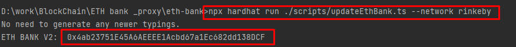

# The ETH Bank Upgradable Proxy

## Problem

### Scenario 1: 
We are launching a decentralized bank that supports basic account operations
Initial version of Smart contract must support the following operations. Smart contract must
also offer optionality to add new business logic after deployment:
1. Account Creation
2. Deposit Amount
3. Withdraw amount
4. Get Account Balance

### Scenario 2: 
Our banking customers are asking for more functionality so we need to support
additional features. However since the version 1 of smart contract is deployed, we need to
upgrade from version 1 to version 2 to support below requirements:
1. Ability to Transfer Amount from one registered account to another within the bank
2. Ability to Send Amount to any external wallet address
### Scenario 3: 
Our bank is has been acquired by larger firm and we need to provide ability to pause
transactions until change of ownership is finalized, so we need to support below requirements:
1. Ability to pause all transactions except withdrawal
2. Ability to change ownership of contract from Owner A to Owner B


## 1. Installation and Deployment
```shell
yarn
```
or
```shell
npm install
```

## 1. Test EthBank contact.

```shell
npx hardhat test
```
#### Result

## 2. Deploy Contracts(ERC20Token1, EthBank, EthBankV2)

#### 1) Deploy ERC20Token1 and EthBank contact on rinkey network
```shell
npx hardhat run ./scripts/deployEthBank.ts --network rinkeby
```
##### example:


#### 2) Save deployed ETHBank address to ETHBANK_ADDRESS in ".env" file.


#### 2) Update EthBank to EthBankV2 on rinkey network

```shell
npx hardhat run ./scripts/updateEthBank.ts --network rinkeby
```



## 2. Etherscan verification

#### 1)


#### 2)

#### 3) Verify the implementation contract
```shell
npx hardhat verify --network rinkeby [DEPLOYED_PROXY_ADDRESS]
```


#### 4)


#### 5)


# Deployment
## Contract Address

Rinkeby: https://rinkeby.etherscan.io/address/0x4ab23751E45A6AEEEE1Acbd67a1Ec682dd138DCF#code

  
